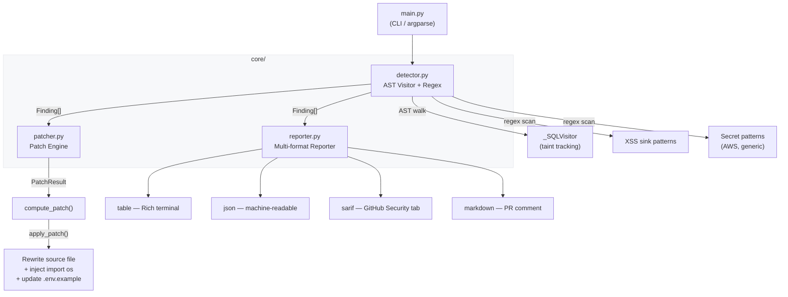

# DevSecOps Scanner

> **Automated static analysis for Python codebases** — detects SQL injection, XSS sinks and hardcoded secrets, auto-remediates findings, and integrates natively with the GitHub Security tab via SARIF v2.1.0.

[](https://github.com/your-org/devsecops-scanner/actions/workflows/security-gate.yml)
[](#benchmark--test-results)
[](https://docs.github.com/en/code-security/code-scanning/integrating-with-code-scanning/sarif-support-for-code-scanning)
[](https://python.org)

---

## Table of Contents

- [Architecture](#architecture)
- [Features](#features)
- [Quickstart](#quickstart)
- [Output Formats](#output-formats)
- [CI/CD Setup](#cicd-setup)
- [Benchmark / Test Results](#benchmark--test-results)
- [Project Structure](#project-structure)

---

## Architecture



**Data flow in detail:**

| Stage | Component | What it does |
|-------|-----------|--------------|
| Parse | `ast.parse()` in `detector.py` | Builds the AST from each `.py` file |
| Visit | `_SQLVisitor` | Walks the AST; tracks tainted variable assignments; flags unsafe `.execute()` calls |
| Regex | `scan_file()` | Line-by-line scan for XSS sinks and hardcoded credential patterns |
| Report | `reporter.py` | Emits `table`, `json`, `sarif`, or `markdown` output |
| Patch | `patcher.py` | Rewrites lines in-place; injects `import os`; updates `.env.example` |

---

## Features

- 🔴 **SQL Injection** — detects f-strings, `%`-format, `.format()` and string concatenation inside `.execute()` calls, including taint-propagated variables
- 🟡 **XSS Sinks** — flags `render_template_string`, `Markup`, `mark_safe`, `HttpResponse`, `Response`
- 🟣 **Hardcoded Secrets** — catches AWS key IDs, AWS secret access keys, and generic `password`/`token`/`api_key` assignments
- 🔧 **Auto-remediation** (`--fix`) — rewrites SQL queries to parameterised form, replaces hardcoded secrets with `os.getenv()`, injects `import os`, updates `.env.example`
- 📤 **Multi-format output** — `table`, `json`, `sarif`, `markdown`
- 🏷️ **SARIF v2.1.0** — upload to GitHub Security tab with `github/codeql-action/upload-sarif`
- ✅ **42 passing tests**, 0 false positives on parameterised queries and `os.environ` reads

---

## Quickstart

### Prerequisites

```bash
python -m venv venv
source venv/bin/activate
pip install -r requirements.txt
```

### Scan a directory (table output)

```bash
python main.py ./my_project
```

### Scan with auto-remediation

```bash
python main.py ./my_project --fix
```

Each finding is shown with a unified diff; you confirm or skip each fix interactively.

### Export a SARIF report

```bash
python main.py ./my_project --format sarif --output results.sarif
```

### Export a GitHub PR comment (Markdown)

```bash
python main.py ./my_project --format markdown --output security-report.md
```

### Machine-readable JSON dump

```bash
python main.py ./my_project --format json --output findings.json
```

---

## Output Formats

| Flag | Description | Use-case |
|------|-------------|----------|
| `--format table` | Rich colour-coded table in the terminal (default) | Local development |
| `--format json` | JSON object with `generated_at`, `total`, `findings[]` | Downstream tooling / dashboards |
| `--format sarif` | SARIF v2.1.0 document with rule metadata | GitHub Security tab / VS Code SARIF viewer |
| `--format markdown` | PR comment with collapsible `<details>` blocks per file | GitHub PR automation |

Add `--output <file>` to write non-table formats to a file instead of stdout.

### SARIF rule mapping

| Rule ID | Covers | Severity |
|---------|--------|----------|
| `DS001` | Unparameterised SQL | `error` |
| `DS002` | Potential XSS Sink | `warning` |
| `DS003` | Hardcoded Secret | `error` |

---

## CI/CD Setup

The workflow at [`.github/workflows/security-gate.yml`](.github/workflows/security-gate.yml) runs on every `push` and `pull_request`.

### What the workflow does

```
Checkout → Set up Python 3.12 → Install deps
    → pytest (with JUnit XML artifact)
    → python main.py . --format sarif --output results.sarif
    → github/codeql-action/upload-sarif   ← populates GitHub Security tab
    → python main.py . --format table     ← fails the job if findings exist
```

### Enabling in your repository

1. Copy `.github/workflows/security-gate.yml` to your repo.
2. Ensure `permissions: security-events: write` is set (already included).
3. Push — the Security tab will show findings under **Code scanning alerts**.

### Viewing results

- **GitHub Security tab → Code scanning** — findings from every SARIF upload
- **PR checks** — the `Assert no findings` step blocks merges when vulnerabilities are detected
- **Annotations** — GitHub inline annotations on the diff for each finding location

---

## Benchmark / Test Results

```
pytest tests/ -v
```

```
tests/test_detector.py::TestSQLDetection::test_fstring_inline              PASSED
tests/test_detector.py::TestSQLDetection::test_fstring_variable            PASSED
tests/test_detector.py::TestSQLDetection::test_percent_format_inline       PASSED
tests/test_detector.py::TestSQLDetection::test_format_method               PASSED
tests/test_detector.py::TestSQLDetection::test_concatenation_variable      PASSED
tests/test_detector.py::TestSQLDetection::test_safe_parameterised_not_flagged PASSED  ← 0 false positives
tests/test_detector.py::TestSQLDetection::test_finding_has_remediation     PASSED
tests/test_detector.py::TestSecretDetection::test_aws_access_key_id        PASSED
tests/test_detector.py::TestSecretDetection::test_aws_secret_access_key    PASSED
tests/test_detector.py::TestSecretDetection::test_generic_api_token        PASSED
tests/test_detector.py::TestSecretDetection::test_generic_password         PASSED
tests/test_detector.py::TestSecretDetection::test_short_value_not_flagged  PASSED  ← 0 false positives
tests/test_detector.py::TestSecretDetection::test_env_var_usage_not_flagged PASSED ← 0 false positives
tests/test_detector.py::TestSecretDetection::test_secret_snippet_in_finding PASSED
tests/test_detector.py::TestSecretDetection::test_secret_line_number       PASSED
tests/test_detector.py::TestXSSDetection::test_markup_sink                 PASSED
tests/test_detector.py::TestXSSDetection::test_render_template_string_sink PASSED
tests/test_detector.py::TestXSSDetection::test_mark_safe_sink              PASSED
tests/test_detector.py::TestXSSDetection::test_xss_line_number             PASSED
tests/test_detector.py::TestEdgeCases::test_empty_file                     PASSED
tests/test_detector.py::TestEdgeCases::test_syntax_error_file_falls_back_to_regex PASSED
tests/test_detector.py::TestEdgeCases::test_multiple_findings_in_one_file  PASSED
tests/test_detector.py::TestEdgeCases::test_finding_fields_populated       PASSED
tests/test_patcher.py::TestSecretPatch::test_basic_replacement             PASSED
tests/test_patcher.py::TestSecretPatch::test_var_name_uppercased_in_getenv PASSED
tests/test_patcher.py::TestSecretPatch::test_import_os_injected_when_missing PASSED
tests/test_patcher.py::TestSecretPatch::test_import_os_not_duplicated      PASSED
tests/test_patcher.py::TestSecretPatch::test_env_example_entry_added       PASSED
tests/test_patcher.py::TestSecretPatch::test_apply_writes_getenv           PASSED
tests/test_patcher.py::TestSecretPatch::test_apply_injects_import_os       PASSED
tests/test_patcher.py::TestSecretPatch::test_apply_updates_env_example     PASSED
tests/test_patcher.py::TestSecretPatch::test_env_example_not_duplicated    PASSED
tests/test_patcher.py::TestSecretPatch::test_indented_assignment_preserved PASSED
tests/test_patcher.py::TestSecretPatch::test_returns_none_for_non_matching_line PASSED
tests/test_patcher.py::TestSQLPatch::test_fstring_rewritten                PASSED
tests/test_patcher.py::TestSQLPatch::test_percent_format_rewritten         PASSED
tests/test_patcher.py::TestSQLPatch::test_format_method_rewritten          PASSED
tests/test_patcher.py::TestSQLPatch::test_indentation_preserved            PASSED
tests/test_patcher.py::TestSQLPatch::test_apply_sql_patch_writes_file      PASSED
tests/test_patcher.py::TestSQLPatch::test_multiline_execute_collapsed      PASSED
tests/test_patcher.py::TestSQLPatch::test_returns_none_for_safe_execute    PASSED
tests/test_patcher.py::TestSQLPatch::test_xss_finding_returns_none         PASSED

42 passed in 0.XXs
```

### Key quality properties

| Property | Result |
|----------|--------|
| Parameterised queries flagged | ❌ Never (0 false positives) |
| `os.environ` reads flagged as secrets | ❌ Never (0 false positives) |
| Values < 8 chars flagged as secrets | ❌ Never (0 false positives) |
| Tainted SQL via variable propagation | ✅ Detected |
| Multi-line `execute()` patched | ✅ Collapsed to one line |
| Indentation preserved in patches | ✅ Always |

---

## Project Structure

```
devsecops-scanner/
├── core/
│   ├── detector.py        # AST visitor + regex scan engine
│   ├── patcher.py         # Auto-remediation patch engine
│   └── reporter.py        # Multi-format reporter (table/json/sarif/markdown)
├── tests/
│   ├── test_detector.py   # 23 tests — SQL, XSS, secrets, edge cases
│   ├── test_patcher.py    # 19 tests — secret & SQL patch logic
│   └── test_reporter.py   # reporter format tests (json, sarif, markdown, table)
├── mock_vulnerable_repo/  # Sample files used for manual testing
├── .github/
│   └── workflows/
│       └── security-gate.yml  # CI pipeline + SARIF upload
├── main.py                # CLI entrypoint
└── requirements.txt
```
